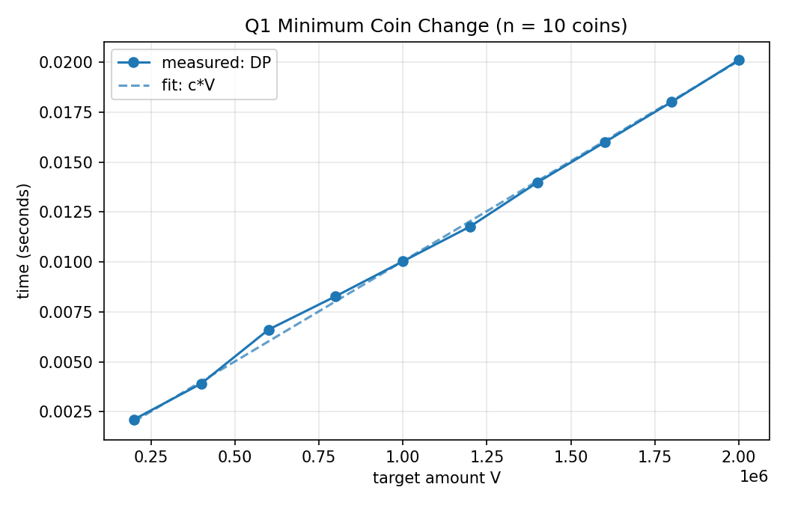
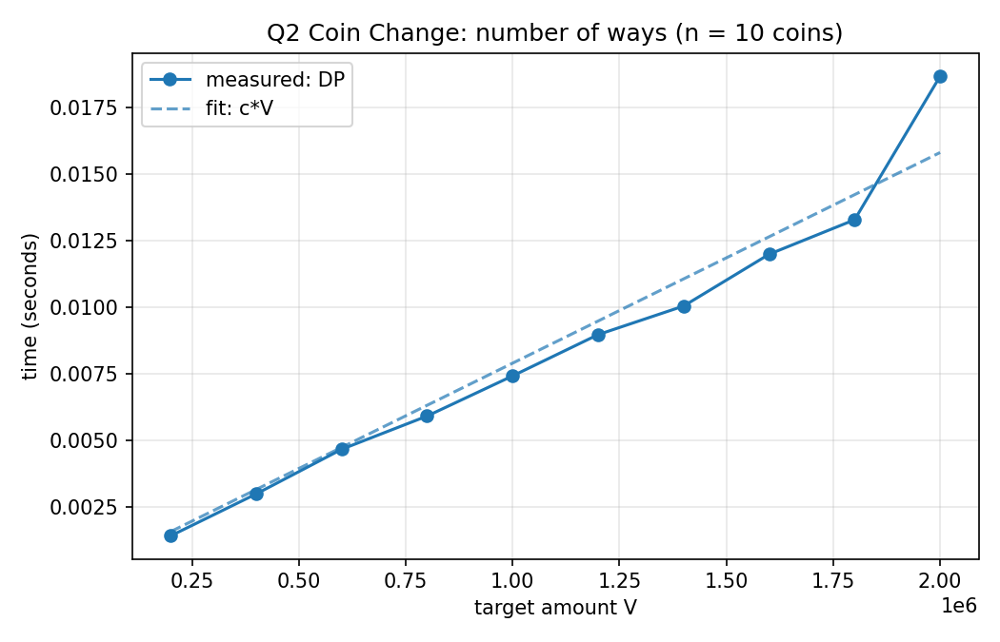
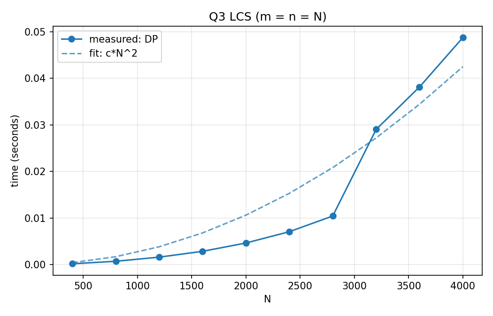
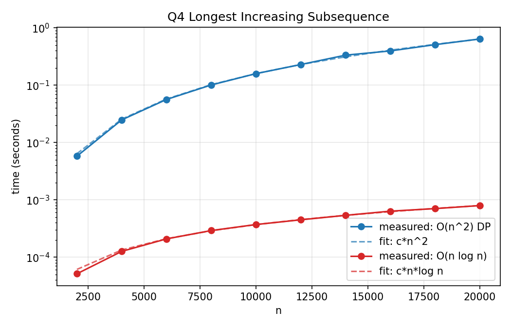
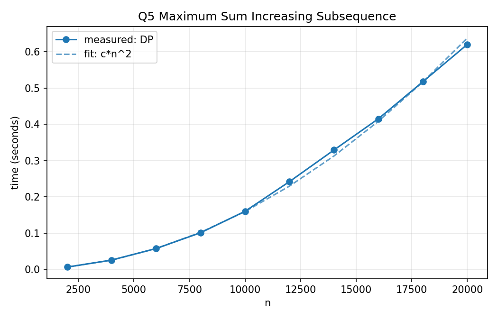
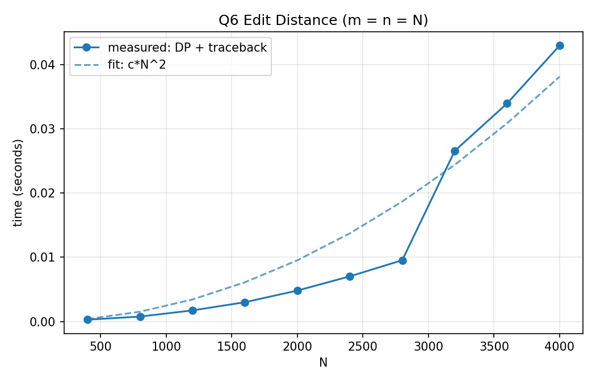
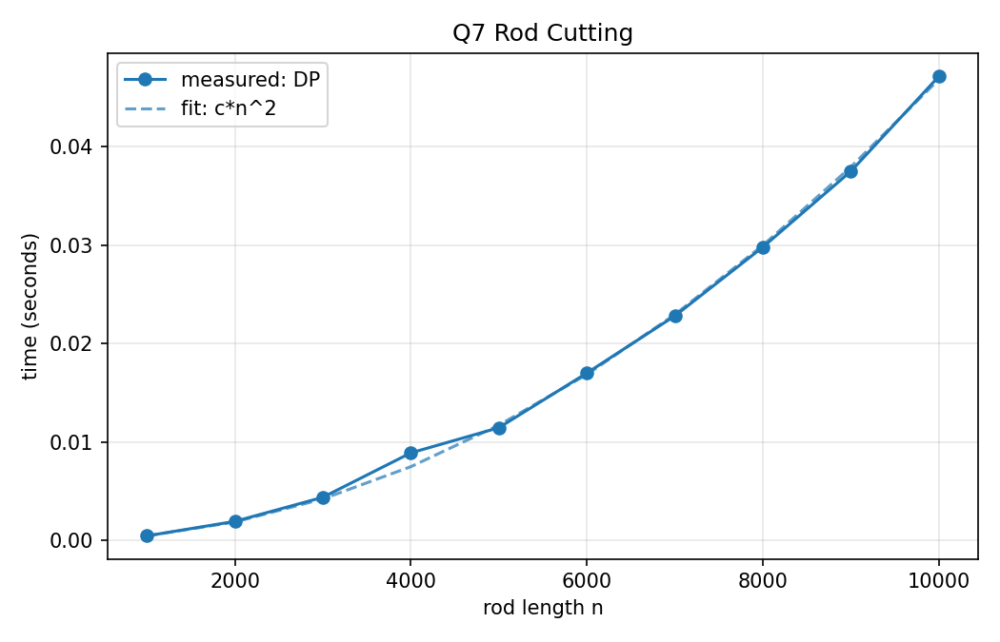
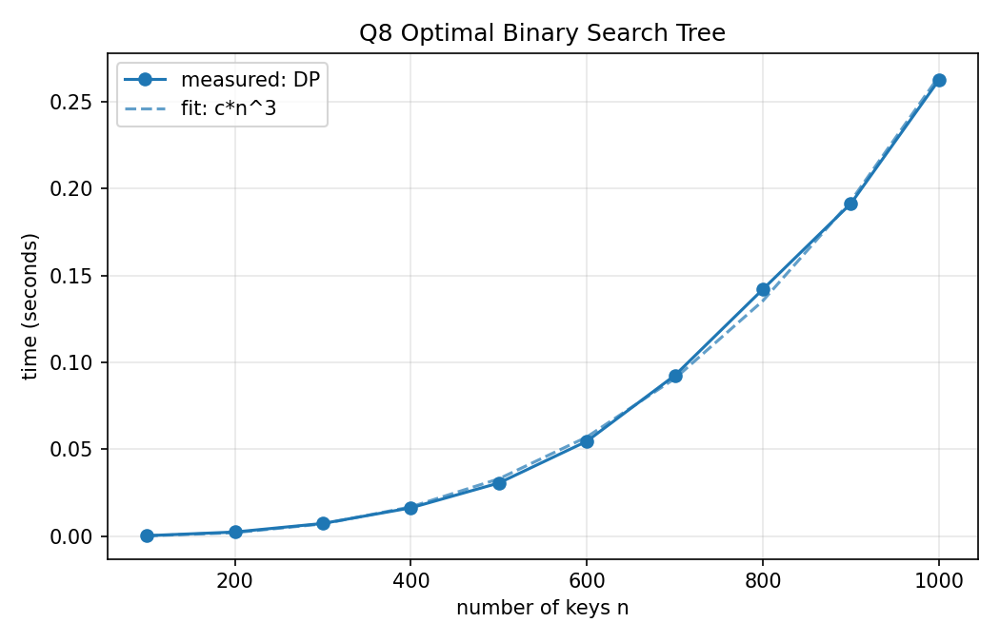
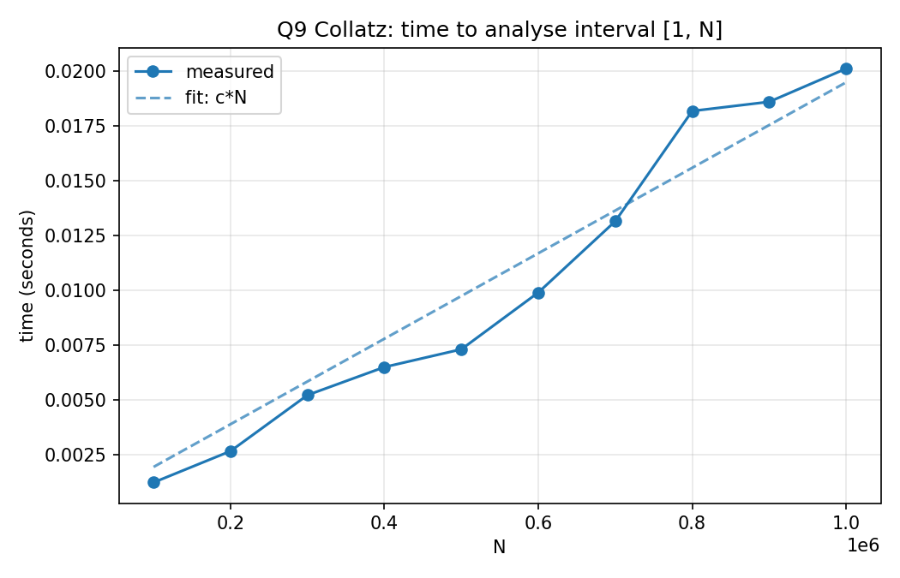

# DAA Lab 08: Dynamic Programming

---

## Question 1: Minimum Coin Change

### Code

```c
#include <stdio.h>
#include <stdlib.h>

#define INF 1000000000

int min_coins(const int *c, int n, int V)
{
    int *dp = malloc((size_t)(V + 1) * sizeof(int));
    dp[0] = 0;
    for (int v = 1; v <= V; v++) {
        dp[v] = INF;
        for (int i = 0; i < n; i++) {
            if (c[i] <= v && dp[v - c[i]] != INF && dp[v - c[i]] + 1 < dp[v])
                dp[v] = dp[v - c[i]] + 1;
        }
    }
    int r = dp[V] == INF ? -1 : dp[V];
    free(dp);
    return r;
}

int main(void)
{
    setvbuf(stdout, NULL, _IONBF, 0);
    int n, V;
    printf("Enter number of coins: ");
    if (scanf("%d", &n) != 1 || n <= 0) {
        printf("Invalid input\n");
        return 1;
    }
    int *c = malloc((size_t)n * sizeof(int));
    printf("Enter %d coin values: ", n);
    for (int i = 0; i < n; i++) {
        if (scanf("%d", &c[i]) != 1 || c[i] <= 0) {
            printf("Invalid input\n");
            return 1;
        }
    }
    printf("Enter target amount V: ");
    if (scanf("%d", &V) != 1 || V < 0) {
        printf("Invalid input\n");
        return 1;
    }
    printf("Minimum number of coins: %d\n", min_coins(c, n, V));
    free(c);
    return 0;
}
```

### Graph



### Time Complexity

**Recurrence:** `dp[0] = 0`, `dp[v] = 1 + min(dp[v - c_i])` over all coins `c_i <= v`. If no coin gives a reachable state, `dp[v] = INF` and the answer is `-1`.

**Derivation:** There are `V + 1` subproblems and each one tries `n` coins in `O(1)` each, so `T(n, V) = sum over v = 1..V of n = n * V`.

| Case | Time |
|------|------|
| Best / Average / Worst | `Θ(n · V)` |

**Space:** `Θ(V)` for the `dp` array.

**Note:** The bound is pseudo-polynomial, because it is polynomial in the value `V` and not in the bit-length `log V`. The plain recursion without memoisation is exponential.

**Graph:** `n = 10` is fixed and `V` varies, so the measured time is linear in `V`.

---

## Question 2: Coin Change, Total Number of Ways

### Code

```c
#include <stdio.h>
#include <stdlib.h>

typedef unsigned long long u64;

u64 count_ways(const int *c, int n, int V)
{
    u64 *dp = calloc((size_t)(V + 1), sizeof(u64));
    dp[0] = 1;
    for (int i = 0; i < n; i++)
        for (int v = c[i]; v <= V; v++)
            dp[v] += dp[v - c[i]];
    u64 r = dp[V];
    free(dp);
    return r;
}

int main(void)
{
    setvbuf(stdout, NULL, _IONBF, 0);
    int n, V;
    printf("Enter number of coins: ");
    if (scanf("%d", &n) != 1 || n <= 0) {
        printf("Invalid input\n");
        return 1;
    }
    int *c = malloc((size_t)n * sizeof(int));
    printf("Enter %d coin values: ", n);
    for (int i = 0; i < n; i++) {
        if (scanf("%d", &c[i]) != 1 || c[i] <= 0) {
            printf("Invalid input\n");
            return 1;
        }
    }
    printf("Enter target amount V: ");
    if (scanf("%d", &V) != 1 || V < 0) {
        printf("Invalid input\n");
        return 1;
    }
    printf("Number of ways: %llu\n", count_ways(c, n, V));
    free(c);
    return 0;
}
```

### Graph



### Time Complexity

**Recurrence:** `ways[0] = 1`. For each coin `c_i` in turn, for `v = c_i..V`: `ways[v] += ways[v - c_i]`.

Coins are the outer loop, so each combination is counted once in a fixed coin order. Swapping the loops would count permutations (`1+2` and `2+1` as different), which the question forbids.

**Derivation:** The outer loop runs `n` times and the inner loop runs at most `V` times, so `T(n, V) = n * V`.

| Case | Time |
|------|------|
| Best / Average / Worst | `Θ(n · V)` |

**Space:** `Θ(V)`. A full 2D table would use `Θ(n · V)`.

**Note:** The number of combinations grows very fast, so the program uses `unsigned long long`. Very large `V` with many small coins can exceed 64 bits and wrap around.

**Graph:** `n = 10` is fixed and `V` varies, so the measured time is linear in `V`.

---

## Question 3: Longest Common Subsequence (LCS)

### Code

```c
#include <stdio.h>
#include <stdlib.h>
#include <string.h>

char *lcs(const char *X, const char *Y, int *len)
{
    int m = (int)strlen(X), n = (int)strlen(Y), w = n + 1;
    int *L = calloc((size_t)(m + 1) * w, sizeof(int));
    for (int i = 1; i <= m; i++) {
        for (int j = 1; j <= n; j++) {
            if (X[i - 1] == Y[j - 1])
                L[i * w + j] = L[(i - 1) * w + j - 1] + 1;
            else if (L[(i - 1) * w + j] >= L[i * w + j - 1])
                L[i * w + j] = L[(i - 1) * w + j];
            else
                L[i * w + j] = L[i * w + j - 1];
        }
    }
    int k = L[m * w + n];
    *len = k;
    char *s = malloc((size_t)k + 1);
    s[k] = '\0';
    int i = m, j = n;
    while (i > 0 && j > 0) {
        if (X[i - 1] == Y[j - 1]) {
            s[--k] = X[i - 1];
            i--;
            j--;
        } else if (L[(i - 1) * w + j] >= L[i * w + j - 1]) {
            i--;
        } else {
            j--;
        }
    }
    free(L);
    return s;
}

int main(void)
{
    setvbuf(stdout, NULL, _IONBF, 0);
    static char X[100001], Y[100001];
    printf("Enter first string: ");
    if (scanf("%100000s", X) != 1) {
        printf("Invalid input\n");
        return 1;
    }
    printf("Enter second string: ");
    if (scanf("%100000s", Y) != 1) {
        printf("Invalid input\n");
        return 1;
    }
    int len;
    char *s = lcs(X, Y, &len);
    printf("Length: %d\n", len);
    printf("LCS: %s\n", s);
    free(s);
    return 0;
}
```

### Graph



### Time Complexity

**Recurrence:** `L[i][j] = L[i-1][j-1] + 1` if `x_i == y_j`, otherwise `max(L[i-1][j], L[i][j-1])`, with `L[0][*] = L[*][0] = 0`.

**Derivation:** The table has `(m + 1)(n + 1)` cells and each one takes `O(1)`. The reconstruction walks from `(m, n)` back to a border, which is at most `m + n` steps. So `T(m, n) = Θ(mn) + O(m + n) = Θ(mn)`.

| Case | Time |
|------|------|
| Best / Average / Worst | `Θ(m · n)` |

**Space:** `Θ(m · n)` for the table, which is needed for reconstruction. If only the length is required, two rows suffice and the space is `Θ(min(m, n))`.

**Graph:** `m = n = N`, so the measured time is quadratic in `N`.

---

## Question 4: Longest Increasing Subsequence

### Code

```c
#include <stdio.h>
#include <stdlib.h>

int lis_quadratic(const int *a, int n, int *seq)
{
    int *dp = malloc((size_t)n * sizeof(int));
    int *prev = malloc((size_t)n * sizeof(int));
    int best = 0, end = -1;
    for (int i = 0; i < n; i++) {
        dp[i] = 1;
        prev[i] = -1;
        for (int j = 0; j < i; j++) {
            if (a[j] < a[i] && dp[j] + 1 > dp[i]) {
                dp[i] = dp[j] + 1;
                prev[i] = j;
            }
        }
        if (dp[i] > best) {
            best = dp[i];
            end = i;
        }
    }
    if (seq) {
        int k = best;
        for (int i = end; i != -1; i = prev[i])
            seq[--k] = a[i];
    }
    free(dp);
    free(prev);
    return best;
}

int lis_fast(const int *a, int n)
{
    int *tail = malloc((size_t)n * sizeof(int));
    int len = 0;
    for (int i = 0; i < n; i++) {
        int lo = 0, hi = len;
        while (lo < hi) {
            int mid = lo + (hi - lo) / 2;
            if (tail[mid] < a[i])
                lo = mid + 1;
            else
                hi = mid;
        }
        tail[lo] = a[i];
        if (lo == len)
            len++;
    }
    free(tail);
    return len;
}

int main(void)
{
    setvbuf(stdout, NULL, _IONBF, 0);
    int n;
    printf("Enter number of elements: ");
    if (scanf("%d", &n) != 1 || n <= 0) {
        printf("Invalid input\n");
        return 1;
    }
    int *a = malloc((size_t)n * sizeof(int));
    printf("Enter %d integers: ", n);
    for (int i = 0; i < n; i++) {
        if (scanf("%d", &a[i]) != 1) {
            printf("Invalid input\n");
            return 1;
        }
    }
    int *seq = malloc((size_t)n * sizeof(int));
    int len = lis_quadratic(a, n, seq);
    printf("Length (O(n^2) DP): %d\n", len);
    printf("Length (O(n log n)): %d\n", lis_fast(a, n));
    printf("One LIS:");
    for (int i = 0; i < len; i++)
        printf(" %d", seq[i]);
    printf("\n");
    free(a);
    free(seq);
    return 0;
}
```

### Graph



### Time Complexity

**Method 1, O(n²) DP (used for reconstruction):** `dp[i] = 1 + max(dp[j])` over all `j < i` with `a[j] < a[i]`, and `prev[i]` stores the chosen `j`.

**Derivation:** The inner loop runs `i` times for index `i`, so `T(n) = sum over i = 0..n-1 of i = n(n-1)/2 = Θ(n²)`. Reconstruction follows `prev[]` in `O(n)`.

**Method 2, O(n log n) (used as a cross-check):** `tail[k]` holds the smallest possible last element of an increasing subsequence of length `k + 1`. Each element does one binary search, `O(log n)`, so `T(n) = Θ(n log n)`.

| Method | Best / Average / Worst | Space |
|--------|------------------------|-------|
| DP | `Θ(n²)` | `Θ(n)` |
| Binary search | `Θ(n log n)` | `Θ(n)` |

**Graph:** Both methods are plotted on a log scale. The DP curve follows `n²` and the binary-search curve follows `n log n`.

---

## Question 5: Maximum Sum Increasing Subsequence

### Code

```c
#include <stdio.h>
#include <stdlib.h>

typedef long long ll;

ll msis(const int *a, int n, int *seq, int *len)
{
    ll *dp = malloc((size_t)n * sizeof(ll));
    int *prev = malloc((size_t)n * sizeof(int));
    ll best = 0;
    int end = -1;
    for (int i = 0; i < n; i++) {
        dp[i] = a[i];
        prev[i] = -1;
        for (int j = 0; j < i; j++) {
            if (a[j] < a[i] && dp[j] + a[i] > dp[i]) {
                dp[i] = dp[j] + a[i];
                prev[i] = j;
            }
        }
        if (dp[i] > best) {
            best = dp[i];
            end = i;
        }
    }
    if (seq) {
        int k = 0;
        for (int i = end; i != -1; i = prev[i])
            seq[k++] = a[i];
        for (int i = 0; i < k / 2; i++) {
            int t = seq[i];
            seq[i] = seq[k - 1 - i];
            seq[k - 1 - i] = t;
        }
        *len = k;
    }
    free(dp);
    free(prev);
    return best;
}

int main(void)
{
    setvbuf(stdout, NULL, _IONBF, 0);
    int n;
    printf("Enter number of elements: ");
    if (scanf("%d", &n) != 1 || n <= 0) {
        printf("Invalid input\n");
        return 1;
    }
    int *a = malloc((size_t)n * sizeof(int));
    printf("Enter %d positive integers: ", n);
    for (int i = 0; i < n; i++) {
        if (scanf("%d", &a[i]) != 1 || a[i] <= 0) {
            printf("Invalid input\n");
            return 1;
        }
    }
    int *seq = malloc((size_t)n * sizeof(int));
    int len = 0;
    ll best = msis(a, n, seq, &len);
    printf("Maximum sum: %lld\n", best);
    printf("Subsequence:");
    for (int i = 0; i < len; i++)
        printf(" %d", seq[i]);
    printf("\n");
    free(a);
    free(seq);
    return 0;
}
```

### Graph



### Time Complexity

**Recurrence:** `dp[i] = a[i] + max(dp[j])` over all `j < i` with `a[j] < a[i]`, or `dp[i] = a[i]` if no such `j` exists. The answer is `max(dp[i])`, and `prev[i]` stores the chosen `j` for reconstruction.

**Derivation:** The inner loop runs `i` times for index `i`, so `T(n) = sum over i = 0..n-1 of i = n(n-1)/2 = Θ(n²)`. Reconstruction is `O(n)`.

| Case | Time |
|------|------|
| Best / Average / Worst | `Θ(n²)` |

**Space:** `Θ(n)`.

**Note:** Sums use `long long`. The `O(n log n)` version is also possible using a Fenwick tree (BIT) over the compressed values.

**Graph:** The measured time is quadratic in `n`.

---

## Question 6: Edit Distance with Traceback

### Code

```c
#include <stdio.h>
#include <stdlib.h>
#include <string.h>

static int min3(int a, int b, int c)
{
    int m = a < b ? a : b;
    return m < c ? m : c;
}

int edit_distance(const char *A, const char *B, int verbose)
{
    int m = (int)strlen(A), n = (int)strlen(B), w = n + 1;
    int *D = malloc((size_t)(m + 1) * w * sizeof(int));
    for (int i = 0; i <= m; i++)
        D[i * w] = i;
    for (int j = 0; j <= n; j++)
        D[j] = j;
    for (int i = 1; i <= m; i++)
        for (int j = 1; j <= n; j++)
            D[i * w + j] = min3(D[(i - 1) * w + j - 1] + (A[i - 1] != B[j - 1]),
                                D[(i - 1) * w + j] + 1,
                                D[i * w + j - 1] + 1);
    int result = D[m * w + n];
    if (verbose) {
        int cap = m + n + 1;
        char *op = malloc((size_t)cap);
        int *ia = malloc((size_t)cap * sizeof(int));
        int *ib = malloc((size_t)cap * sizeof(int));
        int k = 0, i = m, j = n;
        while (i > 0 || j > 0) {
            if (i > 0 && j > 0 &&
                D[i * w + j] == D[(i - 1) * w + j - 1] + (A[i - 1] != B[j - 1])) {
                op[k] = A[i - 1] == B[j - 1] ? 'M' : 'S';
                ia[k] = i - 1;
                ib[k] = j - 1;
                i--;
                j--;
            } else if (i > 0 && D[i * w + j] == D[(i - 1) * w + j] + 1) {
                op[k] = 'D';
                ia[k] = i - 1;
                ib[k] = -1;
                i--;
            } else {
                op[k] = 'I';
                ia[k] = -1;
                ib[k] = j - 1;
                j--;
            }
            k++;
        }
        printf("Traceback (start to end):\n");
        int step = 0;
        for (int t = k - 1; t >= 0; t--) {
            if (op[t] == 'M')
                printf("  keep       '%c'\n", A[ia[t]]);
            else if (op[t] == 'S')
                printf("  %2d substitute '%c' -> '%c' at A[%d]\n", ++step, A[ia[t]], B[ib[t]], ia[t]);
            else if (op[t] == 'D')
                printf("  %2d delete     '%c' at A[%d]\n", ++step, A[ia[t]], ia[t]);
            else
                printf("  %2d insert     '%c' from B[%d]\n", ++step, B[ib[t]], ib[t]);
        }
        free(op);
        free(ia);
        free(ib);
    }
    free(D);
    return result;
}

int main(void)
{
    setvbuf(stdout, NULL, _IONBF, 0);
    static char A[100001], B[100001];
    printf("Enter string A: ");
    if (scanf("%100000s", A) != 1) {
        printf("Invalid input\n");
        return 1;
    }
    printf("Enter string B: ");
    if (scanf("%100000s", B) != 1) {
        printf("Invalid input\n");
        return 1;
    }
    int d = edit_distance(A, B, 1);
    printf("Minimum edit distance: %d\n", d);
    return 0;
}
```

### Graph



### Time Complexity

**Recurrence:** `D[i][0] = i`, `D[0][j] = j`, and `D[i][j] = min(D[i-1][j-1] + [A_i != B_j], D[i-1][j] + 1, D[i][j-1] + 1)`. The three terms are substitute (or match), delete and insert.

**Derivation:** The table has `(m + 1)(n + 1)` cells and each one takes `O(1)`. The traceback starts at `(m, n)` and every step decreases `i`, `j` or both, so it takes at most `m + n` steps. So `T(m, n) = Θ(mn) + O(m + n) = Θ(mn)`.

| Case | Time |
|------|------|
| Best / Average / Worst | `Θ(m · n)` |

**Space:** `Θ(m · n)`, since the full table is needed for the traceback. Without traceback, two rows give `Θ(min(m, n))`.

**Graph:** `m = n = N`, so the measured time is quadratic in `N`.

---

## Question 7: Rod Cutting with Reconstruction

### Code

```c
#include <stdio.h>
#include <stdlib.h>

typedef long long ll;

ll rod_cut(const int *p, int n, int *pieces, int *count)
{
    ll *r = malloc((size_t)(n + 1) * sizeof(ll));
    int *cut = malloc((size_t)(n + 1) * sizeof(int));
    r[0] = 0;
    for (int j = 1; j <= n; j++) {
        r[j] = -1;
        for (int i = 1; i <= j; i++) {
            if (p[i] + r[j - i] > r[j]) {
                r[j] = p[i] + r[j - i];
                cut[j] = i;
            }
        }
    }
    ll best = r[n];
    if (pieces) {
        int k = 0;
        for (int j = n; j > 0; j -= cut[j])
            pieces[k++] = cut[j];
        *count = k;
    }
    free(r);
    free(cut);
    return best;
}

int main(void)
{
    setvbuf(stdout, NULL, _IONBF, 0);
    int n;
    printf("Enter rod length n: ");
    if (scanf("%d", &n) != 1 || n <= 0) {
        printf("Invalid input\n");
        return 1;
    }
    int *p = malloc((size_t)(n + 1) * sizeof(int));
    printf("Enter %d prices (for lengths 1 to %d): ", n, n);
    for (int i = 1; i <= n; i++) {
        if (scanf("%d", &p[i]) != 1) {
            printf("Invalid input\n");
            return 1;
        }
    }
    int *pieces = malloc((size_t)n * sizeof(int));
    int count = 0;
    ll best = rod_cut(p, n, pieces, &count);
    printf("Maximum revenue: %lld\n", best);
    printf("Pieces:");
    for (int i = 0; i < count; i++)
        printf(" %d", pieces[i]);
    printf("\n");
    free(p);
    free(pieces);
    return 0;
}
```

### Graph



### Time Complexity

**Recurrence:** `r[0] = 0`, `r[j] = max over 1 <= i <= j of (p_i + r[j - i])`. `cut[j]` stores the best first piece, and the pieces are recovered by following `j -> j - cut[j]`.

**Derivation:** The inner loop runs `j` times for each `j`, so `T(n) = sum over j = 1..n of j = n(n+1)/2 = Θ(n²)`. Reconstruction is `O(n)`, since each piece has length at least 1.

| Case | Time |
|------|------|
| Best / Average / Worst | `Θ(n²)` |

**Space:** `Θ(n)`.

**Note:** The naive recursion satisfies `T(n) = 1 + sum of T(j)`, which gives `T(n) = 2^n`, so the DP is an exponential-to-polynomial improvement.

**Graph:** The measured time is quadratic in `n`.

---

## Question 8: Optimal Binary Search Tree

### Code

```c
#include <stdio.h>
#include <stdlib.h>

#define INF 1e18

double optimal_bst(const double *p, const double *q, int n, int **root_out)
{
    int W = n + 2;
    double *e = malloc((size_t)W * W * sizeof(double));
    double *w = malloc((size_t)W * W * sizeof(double));
    int *root = calloc((size_t)W * W, sizeof(int));
    for (int i = 1; i <= n + 1; i++) {
        e[i * W + i - 1] = q[i - 1];
        w[i * W + i - 1] = q[i - 1];
    }
    for (int l = 1; l <= n; l++) {
        for (int i = 1; i <= n - l + 1; i++) {
            int j = i + l - 1;
            e[i * W + j] = INF;
            w[i * W + j] = w[i * W + j - 1] + p[j] + q[j];
            for (int r = i; r <= j; r++) {
                double t = e[i * W + r - 1] + e[(r + 1) * W + j] + w[i * W + j];
                if (t < e[i * W + j]) {
                    e[i * W + j] = t;
                    root[i * W + j] = r;
                }
            }
        }
    }
    double cost = e[1 * W + n];
    free(e);
    free(w);
    if (root_out)
        *root_out = root;
    else
        free(root);
    return cost;
}

static void print_tree(const int *root, int W, int i, int j, int parent, const char *side)
{
    if (i > j) {
        printf("  d%d is the %s child of k%d\n", j, side, parent);
        return;
    }
    int r = root[i * W + j];
    if (parent == 0)
        printf("  k%d is the root\n", r);
    else
        printf("  k%d is the %s child of k%d\n", r, side, parent);
    print_tree(root, W, i, r - 1, r, "left");
    print_tree(root, W, r + 1, j, r, "right");
}

int main(void)
{
    setvbuf(stdout, NULL, _IONBF, 0);
    int n;
    printf("Enter number of keys n: ");
    if (scanf("%d", &n) != 1 || n <= 0) {
        printf("Invalid input\n");
        return 1;
    }
    double *p = calloc((size_t)(n + 1), sizeof(double));
    double *q = calloc((size_t)(n + 1), sizeof(double));
    printf("Enter %d probabilities p1..p%d: ", n, n);
    for (int i = 1; i <= n; i++) {
        if (scanf("%lf", &p[i]) != 1) {
            printf("Invalid input\n");
            return 1;
        }
    }
    printf("Enter %d probabilities q0..q%d: ", n + 1, n);
    for (int i = 0; i <= n; i++) {
        if (scanf("%lf", &q[i]) != 1) {
            printf("Invalid input\n");
            return 1;
        }
    }
    int *root;
    double cost = optimal_bst(p, q, n, &root);
    printf("Minimum expected search cost: %.4f\n", cost);
    printf("Structure of the optimal tree:\n");
    print_tree(root, n + 2, 1, n, 0, "");
    free(p);
    free(q);
    free(root);
    return 0;
}
```

### Graph



### Time Complexity

**Recurrence:** Let `w(i, j) = sum of p_i..p_j + sum of q_(i-1)..q_j`. Then `e[i][i-1] = q_(i-1)` and `e[i][j] = min over i <= r <= j of (e[i][r-1] + e[r+1][j] + w(i, j))`. `root[i][j]` stores the best `r`.

**Derivation:** There are three nested loops: chain length `l = 1..n`, start `i = 1..n-l+1`, and root `r = i..j`, which has `l` choices. So `T(n) = sum over l = 1..n of (n - l + 1) * l = n(n+1)(n+2)/6 = Θ(n³)`. Printing the tree is `O(n)`.

| Case | Time |
|------|------|
| Best / Average / Worst | `Θ(n³)` |

**Space:** `Θ(n²)` for the `e`, `w` and `root` tables.

**Note:** Knuth's optimisation restricts `r` to `root[i][j-1] <= r <= root[i+1][j]` and reduces the time to `O(n²)`.

**Graph:** The measured time is cubic in `n`.

---

## Question 9: Collatz Conjecture

### Code

```c
#include <stdio.h>
#include <stdlib.h>
#include <limits.h>

typedef unsigned long long u64;

static int collatz_step(u64 n, u64 *out)
{
    if (n % 2 == 0) {
        *out = n / 2;
        return 1;
    }
    if (n > (ULLONG_MAX - 1) / 3)
        return 0;
    *out = 3 * n + 1;
    return 1;
}

static void single(u64 start)
{
    size_t cap = 64, len = 0;
    u64 *t = malloc(cap * sizeof(u64));
    u64 n = start, peak = start;
    int ok = 1;
    t[len++] = n;
    while (n != 1) {
        u64 nx;
        if (!collatz_step(n, &nx)) {
            ok = 0;
            break;
        }
        n = nx;
        if (len == cap) {
            cap *= 2;
            t = realloc(t, cap * sizeof(u64));
        }
        t[len++] = n;
        if (n > peak)
            peak = n;
    }
    printf("Trajectory:");
    for (size_t i = 0; i < len; i++)
        printf(" %llu", t[i]);
    printf("\n");
    if (ok) {
        printf("Start: %llu\n", start);
        printf("Steps to reach 1: %zu\n", len - 1);
        printf("Peak value: %llu\n", peak);
    } else {
        printf("Stopped: next value would overflow 64-bit unsigned integer\n");
    }
    free(t);
}

static void interval(u64 a, u64 b)
{
    u64 *peak = calloc(b + 1, sizeof(u64));
    unsigned *steps = calloc(b + 1, sizeof(unsigned));
    size_t cap = 1024, len;
    u64 *path = malloc(cap * sizeof(u64));
    peak[1] = 1;
    steps[1] = 0;
    u64 best_start = a, best_steps = 0, peak_start = a, peak_val = 0;
    u64 overflowed = 0;
    double sum = 0;
    for (u64 s = a; s <= b; s++) {
        len = 0;
        u64 n = s;
        int ok = 1;
        while (!(n <= b && peak[n] != 0)) {
            if (len == cap) {
                cap *= 2;
                path = realloc(path, cap * sizeof(u64));
            }
            path[len++] = n;
            u64 nx;
            if (!collatz_step(n, &nx)) {
                ok = 0;
                break;
            }
            n = nx;
        }
        if (!ok) {
            overflowed++;
            continue;
        }
        u64 cur_steps = steps[n], cur_peak = peak[n];
        for (size_t i = len; i-- > 0;) {
            cur_steps++;
            if (path[i] > cur_peak)
                cur_peak = path[i];
            if (path[i] <= b) {
                steps[path[i]] = (unsigned)cur_steps;
                peak[path[i]] = cur_peak;
            }
        }
        u64 ss = steps[s], pp = peak[s];
        sum += (double)ss;
        if (ss > best_steps) {
            best_steps = ss;
            best_start = s;
        }
        if (pp > peak_val) {
            peak_val = pp;
            peak_start = s;
        }
    }
    printf("Interval: [%llu, %llu]\n", a, b);
    printf("Longest trajectory: start %llu with %llu steps\n", best_start, best_steps);
    printf("Highest peak: start %llu reaches %llu\n", peak_start, peak_val);
    printf("Average steps: %.4f\n", sum / (double)(b - a + 1 - overflowed));
    printf("Starts skipped due to overflow: %llu\n", overflowed);
    free(peak);
    free(steps);
    free(path);
}

int main(void)
{
    setvbuf(stdout, NULL, _IONBF, 0);
    int mode;
    printf("Enter mode (1 = single number, 2 = interval): ");
    if (scanf("%d", &mode) != 1) {
        printf("Invalid input\n");
        return 1;
    }
    if (mode == 1) {
        u64 n;
        printf("Enter starting value n (>= 1): ");
        if (scanf("%llu", &n) != 1 || n < 1) {
            printf("Invalid input\n");
            return 1;
        }
        single(n);
    } else if (mode == 2) {
        u64 a, b;
        printf("Enter interval a and b (1 <= a <= b): ");
        if (scanf("%llu %llu", &a, &b) != 2 || a < 1 || b < a) {
            printf("Invalid input\n");
            return 1;
        }
        interval(a, b);
    } else {
        printf("Invalid mode\n");
        return 1;
    }
    return 0;
}
```

### Graph



### Time Complexity

**Single starting value `n`:** The cost equals the number of steps `S(n)` until the value reaches 1, and each step is `O(1)`. No upper bound on `S(n)` is proven, since that would settle the conjecture. Heuristically, and in experiments, `S(n) = Θ(log n)` on average, and the trajectory array uses `O(S(n))` memory.

**Interval `[a, b]`:** The steps and peak of each value `<= b` are stored, and a walk stops as soon as it reaches a cached value. Most walks are then short, so the total is empirically close to linear in `N = b - a + 1`. Without this cache every start is walked to 1 separately, which costs about `Θ(N log N)`. Space is `Θ(b)` for the cache.

| Task | Time | Space |
|------|------|-------|
| One value | `O(S(n))`, `Θ(log n)` on average | `O(S(n))` |
| Interval `[1, N]` | `≈ Θ(N)` | `Θ(b)` |

**Overflow:** Before computing `3n + 1` the program checks `n > (ULLONG_MAX - 1) / 3` and stops safely instead of wrapping around.

**Graph:** The measured time for the interval `[1, N]` grows linearly with `N`.
