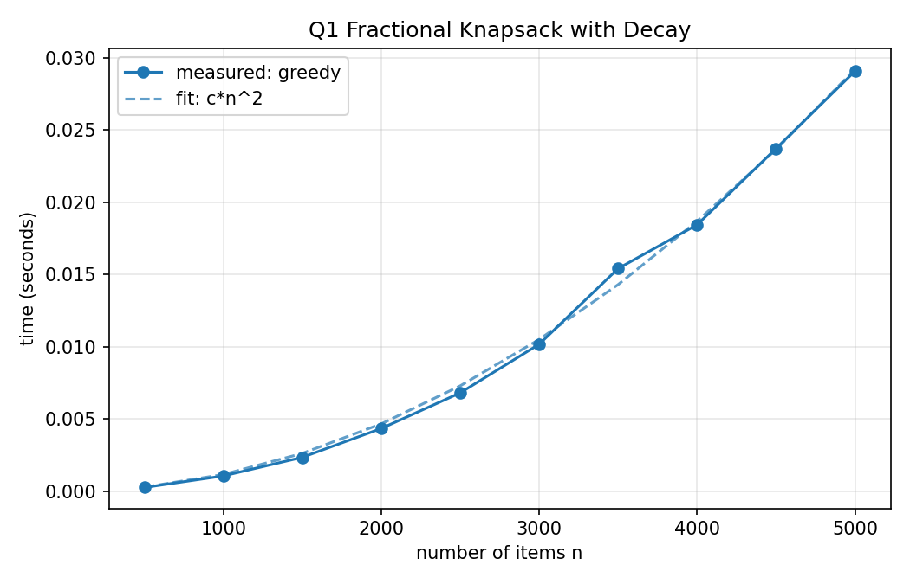
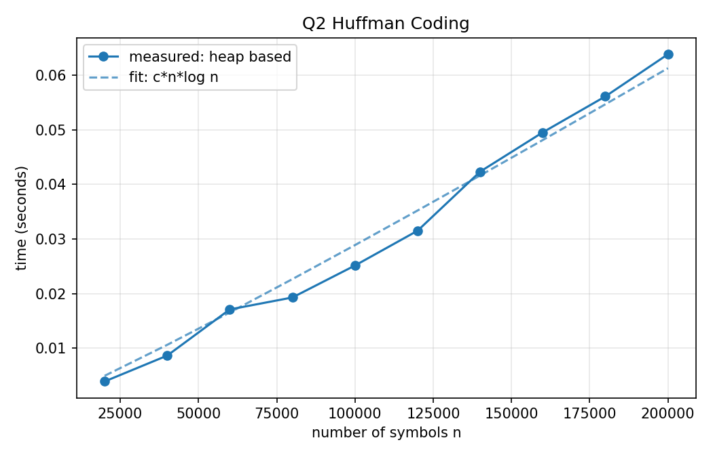
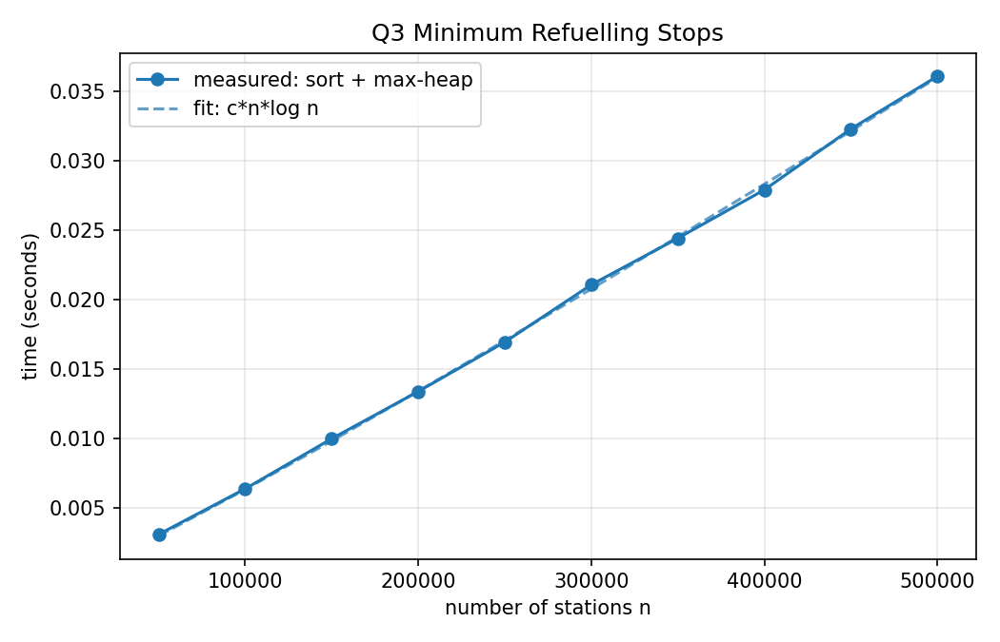
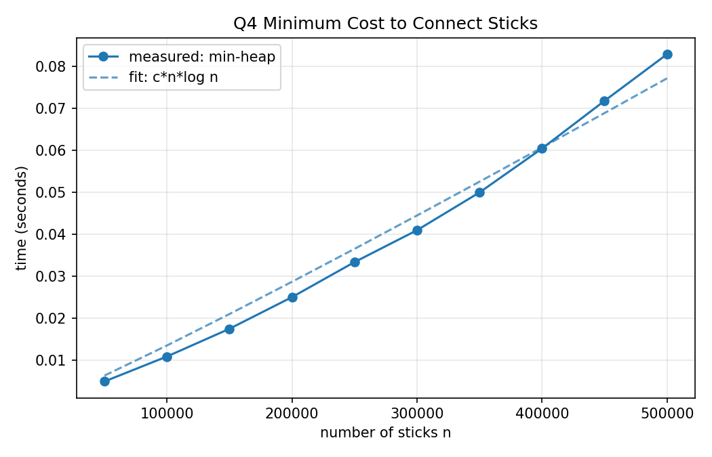
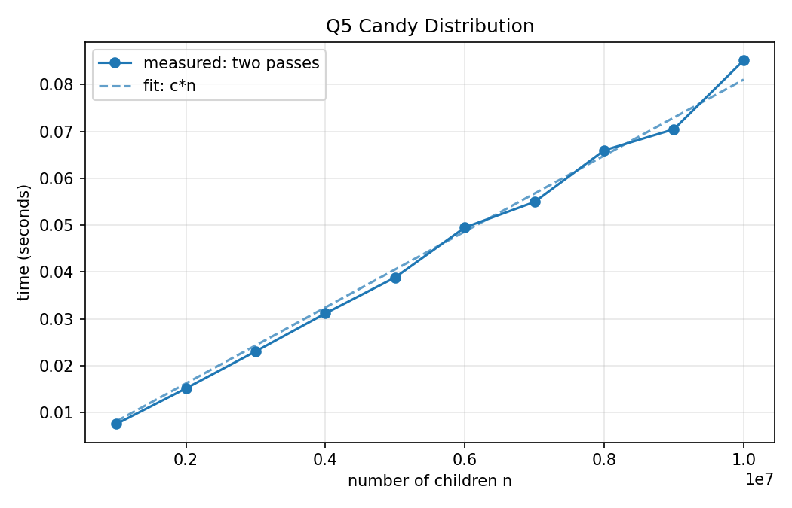
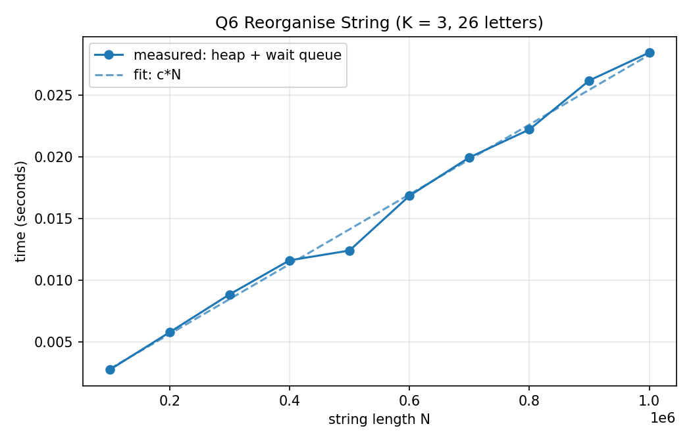
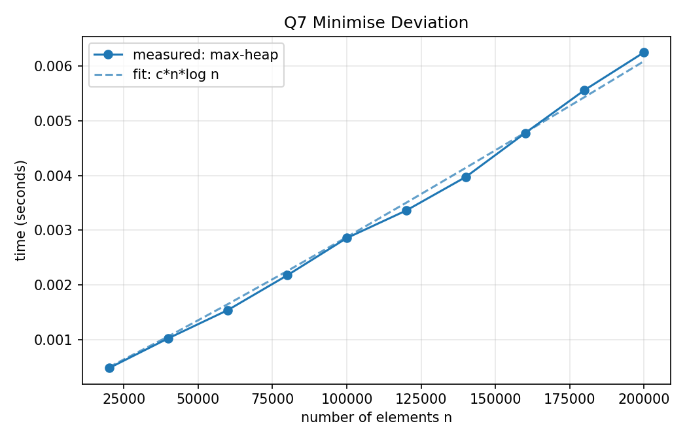
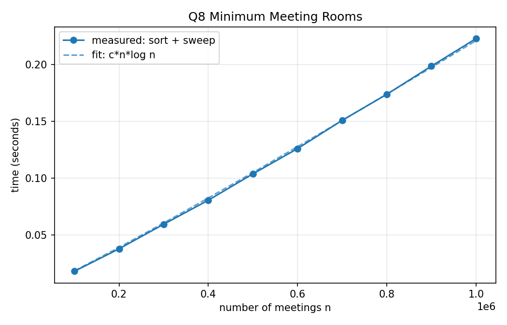
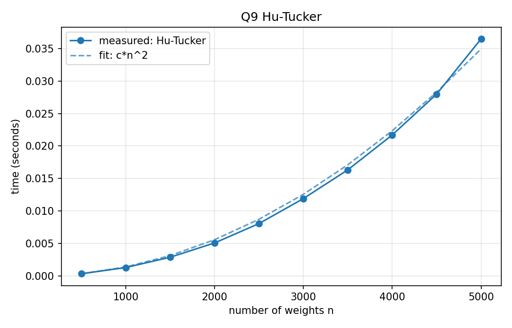
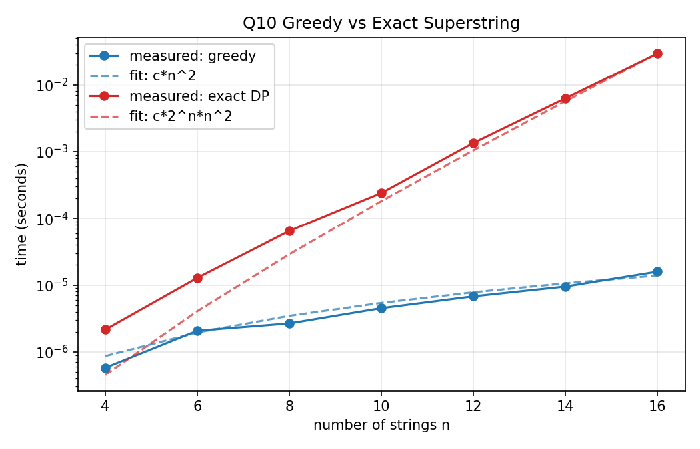

# DAA Lab 09: Greedy Algorithms

---

## Question 1: Fractional Knapsack with Deterioration Rate

### Code

```c
#include <stdio.h>
#include <stdlib.h>

typedef struct {
    double v, w, lambda;
    int used;
} Item;

double schedule(Item *it, int n, double W, int verbose)
{
    double t = 0, total = 0;
    int step = 0;
    while (t < W) {
        int best = -1;
        double bestd = 0;
        for (int i = 0; i < n; i++) {
            if (it[i].used)
                continue;
            double d = it[i].v / it[i].w - it[i].lambda * t;
            if (d > bestd) {
                bestd = d;
                best = i;
            }
        }
        if (best < 0)
            break;
        double amt = it[best].w < W - t ? it[best].w : W - t;
        double gain = amt * bestd;
        if (verbose)
            printf("  %d. item %d: take %.4f of %.4f (fraction %.4f) at t=%.4f, density %.4f, gain %.4f\n",
                   ++step, best + 1, amt, it[best].w, amt / it[best].w, t, bestd, gain);
        total += gain;
        t += amt;
        it[best].used = 1;
    }
    return total;
}

int main(void)
{
    setvbuf(stdout, NULL, _IONBF, 0);
    int n;
    double W;
    printf("Enter number of items: ");
    if (scanf("%d", &n) != 1 || n <= 0) {
        printf("Invalid input\n");
        return 1;
    }
    Item *it = malloc((size_t)n * sizeof(Item));
    for (int i = 0; i < n; i++) {
        printf("Enter value, weight and decay rate of item %d: ", i + 1);
        if (scanf("%lf %lf %lf", &it[i].v, &it[i].w, &it[i].lambda) != 3 || it[i].w <= 0 || it[i].lambda <= 0) {
            printf("Invalid input\n");
            return 1;
        }
        it[i].used = 0;
    }
    printf("Enter knapsack capacity W: ");
    if (scanf("%lf", &W) != 1 || W < 0) {
        printf("Invalid input\n");
        return 1;
    }
    printf("Schedule:\n");
    double total = schedule(it, n, W, 1);
    printf("Maximum total value: %.4f\n", total);
    free(it);
    return 0;
}
```

### Graph



### Time Complexity

**Model used:** Time `t` is the total weight already consumed (one unit of weight takes one unit of time). An item taken at time `t` has effective density `v/w - λ·t`.

**Greedy choice:** At every step pick the unused item with the highest current effective density. Stop when no density is positive. Take `min(w, remaining capacity)` of it, which makes the last item fractional, then advance `t` by the amount taken.

**Derivation:** Each step scans all `n` items to find the maximum, because the densities change with `t` and the order cannot be fixed by one sort. Each item is picked at most once, so there are at most `n` steps and `T(n) = n + (n-1) + ... + 1 = Θ(n²)`.

| Case | Time | Space |
|------|------|-------|
| Best / Average / Worst | `Θ(n²)` worst, `Θ(n)` if the first pick already fills the knapsack | `Θ(n)` |

**Note:** Items decay at different rates, so choosing by current density is a heuristic that is not always optimal. Example: item A has `v=100, w=10, λ=0.1` and item B has `v=9.9, w=1, λ=5`, with `W=11`. Greedy takes A first and gets 100. Taking B first and then A gives `9.9 + 99 = 108.9`.

**Graph:** All densities stay positive in the benchmark, so the greedy runs all `n` steps and the measured time is quadratic in `n`.

---

## Question 2: Huffman Coding (Canonical Codebook)

### Code

```c
#include <stdio.h>
#include <stdlib.h>
#include <string.h>

static long long *Fq;

static int less_node(int a, int b)
{
    return Fq[a] < Fq[b] || (Fq[a] == Fq[b] && a < b);
}

static void sift_up(int *h, int i)
{
    while (i > 0) {
        int p = (i - 1) / 2;
        if (!less_node(h[i], h[p]))
            break;
        int t = h[i];
        h[i] = h[p];
        h[p] = t;
        i = p;
    }
}

static void sift_down(int *h, int n, int i)
{
    for (;;) {
        int l = 2 * i + 1, r = l + 1, m = i;
        if (l < n && less_node(h[l], h[m]))
            m = l;
        if (r < n && less_node(h[r], h[m]))
            m = r;
        if (m == i)
            break;
        int t = h[i];
        h[i] = h[m];
        h[m] = t;
        i = m;
    }
}

void huffman_lengths(const long long *f, int n, int *len)
{
    if (n == 1) {
        len[0] = 1;
        return;
    }
    int total = 2 * n - 1;
    Fq = malloc((size_t)total * sizeof(long long));
    int *parent = malloc((size_t)total * sizeof(int));
    int *depth = calloc((size_t)total, sizeof(int));
    int *heap = malloc((size_t)n * sizeof(int));
    int hs = 0;
    for (int i = 0; i < n; i++) {
        Fq[i] = f[i];
        parent[i] = -1;
        heap[hs] = i;
        sift_up(heap, hs++);
    }
    int next = n;
    while (hs > 1) {
        int a = heap[0];
        heap[0] = heap[--hs];
        sift_down(heap, hs, 0);
        int b = heap[0];
        heap[0] = heap[--hs];
        sift_down(heap, hs, 0);
        Fq[next] = Fq[a] + Fq[b];
        parent[a] = parent[b] = next;
        parent[next] = -1;
        heap[hs] = next;
        sift_up(heap, hs++);
        next++;
    }
    for (int i = next - 2; i >= 0; i--)
        depth[i] = depth[parent[i]] + 1;
    for (int i = 0; i < n; i++)
        len[i] = depth[i];
    free(Fq);
    free(parent);
    free(depth);
    free(heap);
}

static const int *SL;
static const char *SS;

static int cmp_canonical(const void *a, const void *b)
{
    int x = *(const int *)a, y = *(const int *)b;
    if (SL[x] != SL[y])
        return SL[x] - SL[y];
    return (unsigned char)SS[x] - (unsigned char)SS[y];
}

int main(void)
{
    setvbuf(stdout, NULL, _IONBF, 0);
    int n;
    printf("Enter number of symbols: ");
    if (scanf("%d", &n) != 1 || n <= 0) {
        printf("Invalid input\n");
        return 1;
    }
    char *sym = malloc((size_t)n);
    long long *f = malloc((size_t)n * sizeof(long long));
    for (int i = 0; i < n; i++) {
        printf("Enter symbol and frequency %d: ", i + 1);
        if (scanf(" %c %lld", &sym[i], &f[i]) != 2 || f[i] <= 0) {
            printf("Invalid input\n");
            return 1;
        }
    }
    int *len = malloc((size_t)n * sizeof(int));
    huffman_lengths(f, n, len);
    int *order = malloc((size_t)n * sizeof(int));
    for (int i = 0; i < n; i++)
        order[i] = i;
    SL = len;
    SS = sym;
    qsort(order, (size_t)n, sizeof(int), cmp_canonical);
    int maxlen = len[order[n - 1]];
    char *code = malloc((size_t)maxlen + 2);
    int cl = len[order[0]];
    memset(code, '0', (size_t)cl);
    code[cl] = '\0';
    long long weighted = 0, sum = 0;
    printf("Canonical Huffman codebook:\n");
    printf("  Symbol  Freq  Length  Code\n");
    for (int k = 0; k < n; k++) {
        int i = order[k];
        if (k > 0) {
            int p = cl - 1;
            while (p >= 0 && code[p] == '1')
                code[p--] = '0';
            if (p >= 0)
                code[p] = '1';
            while (cl < len[i])
                code[cl++] = '0';
            code[cl] = '\0';
        }
        printf("  %-6c  %-4lld  %-6d  %s\n", sym[i], f[i], len[i], code);
        weighted += f[i] * len[i];
        sum += f[i];
    }
    printf("Total weighted length: %lld\n", weighted);
    printf("Expected code length: %.4f bits/symbol\n", (double)weighted / (double)sum);
    free(sym);
    free(f);
    free(len);
    free(order);
    free(code);
    return 0;
}
```

### Graph



### Time Complexity

**Greedy choice:** Repeatedly remove the two nodes with the smallest frequency from a min-heap, join them under a new node whose frequency is their sum, and insert it back. The leaf depths give the code lengths.

**Canonical codes:** Symbols are sorted by `(length, symbol)`. The first code is all zeros. Each next code is the previous code plus 1, followed by zeros until it reaches the new length. This gives a unique prefix-free codebook for the same lengths.

**Derivation:** Building the heap takes `n` insertions of `O(log n)` each. There are `n - 1` merges and each does 2 extractions and 1 insertion at `O(log n)`, so `T(n) = O(n log n)`. Computing depths is `O(n)`. Sorting for the canonical order is `O(n log n)`. Writing the codes costs `O(sum of code lengths)`, which is `O(n log n)` for typical inputs and `O(n²)` in the worst case of very skewed (Fibonacci-like) frequencies.

| Case | Time | Space |
|------|------|-------|
| Tree construction | `Θ(n log n)` | `Θ(n)` |

**Graph:** The measured time follows `n log n` for `n` symbols.

---

## Question 3: Minimum Refuelling Stops (Reverse Greedy)

### Code

```c
#include <stdio.h>
#include <stdlib.h>

typedef struct {
    long long d, f;
} Station;

static int cmp_dist(const void *a, const void *b)
{
    const Station *x = a, *y = b;
    return (x->d > y->d) - (x->d < y->d);
}

static void sift_up(Station *h, int i)
{
    while (i > 0) {
        int p = (i - 1) / 2;
        if (h[i].f <= h[p].f)
            break;
        Station t = h[i];
        h[i] = h[p];
        h[p] = t;
        i = p;
    }
}

static void sift_down(Station *h, int n, int i)
{
    for (;;) {
        int l = 2 * i + 1, r = l + 1, m = i;
        if (l < n && h[l].f > h[m].f)
            m = l;
        if (r < n && h[r].f > h[m].f)
            m = r;
        if (m == i)
            break;
        Station t = h[i];
        h[i] = h[m];
        h[m] = t;
        i = m;
    }
}

int min_stops(long long D, long long F, Station *s, int n, long long *used)
{
    qsort(s, (size_t)n, sizeof(Station), cmp_dist);
    Station *heap = malloc((size_t)(n + 1) * sizeof(Station));
    int hs = 0, i = 0, stops = 0;
    long long reach = F;
    while (reach < D) {
        while (i < n && s[i].d <= reach) {
            heap[hs] = s[i++];
            sift_up(heap, hs++);
        }
        if (hs == 0) {
            free(heap);
            return -1;
        }
        Station top = heap[0];
        heap[0] = heap[--hs];
        sift_down(heap, hs, 0);
        reach += top.f;
        if (used)
            used[stops] = top.d;
        stops++;
    }
    free(heap);
    return stops;
}

int main(void)
{
    setvbuf(stdout, NULL, _IONBF, 0);
    long long D, F;
    int n;
    printf("Enter target distance D and initial fuel F: ");
    if (scanf("%lld %lld", &D, &F) != 2 || D < 0 || F < 0) {
        printf("Invalid input\n");
        return 1;
    }
    printf("Enter number of stations: ");
    if (scanf("%d", &n) != 1 || n < 0) {
        printf("Invalid input\n");
        return 1;
    }
    Station *s = malloc((size_t)(n + 1) * sizeof(Station));
    for (int i = 0; i < n; i++) {
        printf("Enter distance and fuel of station %d: ", i + 1);
        if (scanf("%lld %lld", &s[i].d, &s[i].f) != 2 || s[i].d < 0 || s[i].f < 0) {
            printf("Invalid input\n");
            return 1;
        }
    }
    long long *used = malloc((size_t)(n + 1) * sizeof(long long));
    int stops = min_stops(D, F, s, n, used);
    if (stops < 0) {
        printf("Cannot reach the target\n");
    } else {
        printf("Minimum number of refuelling stops: %d\n", stops);
        printf("Refuel at distances:");
        for (int i = 0; i < stops; i++)
            printf(" %lld", used[i]);
        printf("\n");
    }
    free(s);
    free(used);
    return 0;
}
```

### Graph



### Time Complexity

**Greedy choice:** Sort the stations by distance. Drive as far as the current fuel allows and remember the fuel amount of every station passed. Only when the target is not yet reachable, go back in time and refuel at the passed station with the **most** fuel (a max-heap). Repeat until the target is reachable. If the heap is empty while the target is still out of reach, the answer is impossible.

**Derivation:** Sorting takes `O(n log n)`. Every station is pushed once and popped at most once, each at `O(log n)`, so the main loop is `O(n log n)`. Total `T(n) = O(n log n)`.

| Case | Time | Space |
|------|------|-------|
| Best / Average / Worst | `Θ(n log n)` | `Θ(n)` |

**Graph:** The measured time follows `n log n` for `n` stations.

---

## Question 4: Minimum Cost to Connect Sticks

### Code

```c
#include <stdio.h>
#include <stdlib.h>

typedef long long ll;

static void sift_up(ll *h, int i)
{
    while (i > 0) {
        int p = (i - 1) / 2;
        if (h[i] >= h[p])
            break;
        ll t = h[i];
        h[i] = h[p];
        h[p] = t;
        i = p;
    }
}

static void sift_down(ll *h, int n, int i)
{
    for (;;) {
        int l = 2 * i + 1, r = l + 1, m = i;
        if (l < n && h[l] < h[m])
            m = l;
        if (r < n && h[r] < h[m])
            m = r;
        if (m == i)
            break;
        ll t = h[i];
        h[i] = h[m];
        h[m] = t;
        i = m;
    }
}

static ll pop_min(ll *h, int *hs)
{
    ll top = h[0];
    h[0] = h[--(*hs)];
    sift_down(h, *hs, 0);
    return top;
}

ll connect_sticks(const ll *L, int n, int verbose)
{
    ll *h = malloc((size_t)n * sizeof(ll));
    int hs = 0;
    for (int i = 0; i < n; i++) {
        h[hs] = L[i];
        sift_up(h, hs++);
    }
    ll cost = 0;
    while (hs > 1) {
        ll a = pop_min(h, &hs);
        ll b = pop_min(h, &hs);
        cost += a + b;
        if (verbose)
            printf("  connect %lld + %lld = %lld (cost so far %lld)\n", a, b, a + b, cost);
        h[hs] = a + b;
        sift_up(h, hs++);
    }
    free(h);
    return cost;
}

int main(void)
{
    setvbuf(stdout, NULL, _IONBF, 0);
    int n;
    printf("Enter number of sticks: ");
    if (scanf("%d", &n) != 1 || n <= 0) {
        printf("Invalid input\n");
        return 1;
    }
    ll *L = malloc((size_t)n * sizeof(ll));
    printf("Enter %d stick lengths: ", n);
    for (int i = 0; i < n; i++) {
        if (scanf("%lld", &L[i]) != 1 || L[i] <= 0) {
            printf("Invalid input\n");
            return 1;
        }
    }
    printf("Steps:\n");
    ll cost = connect_sticks(L, n, 1);
    printf("Minimum total cost: %lld\n", cost);
    free(L);
    return 0;
}
```

### Graph



### Time Complexity

**Greedy choice:** Always connect the two shortest sticks. A stick merged early is counted again in every later merge that contains it, so short sticks should sit deepest in the merge tree. This is the same idea as Huffman coding.

**Derivation:** Inserting `n` sticks into the min-heap takes `O(n log n)`. There are `n - 1` merges and each does 2 extractions and 1 insertion at `O(log n)`, so `T(n) = O(n log n)`.

| Case | Time | Space |
|------|------|-------|
| Best / Average / Worst | `Θ(n log n)` | `Θ(n)` |

**Graph:** The measured time follows `n log n` for `n` sticks.

---

## Question 5: Candy Distribution (Bi-directional Greedy)

### Code

```c
#include <stdio.h>
#include <stdlib.h>

long long candies(const int *r, int n, int *c)
{
    for (int i = 0; i < n; i++)
        c[i] = 1;
    for (int i = 1; i < n; i++)
        if (r[i] > r[i - 1])
            c[i] = c[i - 1] + 1;
    for (int i = n - 2; i >= 0; i--)
        if (r[i] > r[i + 1] && c[i] <= c[i + 1])
            c[i] = c[i + 1] + 1;
    long long sum = 0;
    for (int i = 0; i < n; i++)
        sum += c[i];
    return sum;
}

int main(void)
{
    setvbuf(stdout, NULL, _IONBF, 0);
    int n;
    printf("Enter number of children: ");
    if (scanf("%d", &n) != 1 || n <= 0) {
        printf("Invalid input\n");
        return 1;
    }
    int *r = malloc((size_t)n * sizeof(int));
    int *c = malloc((size_t)n * sizeof(int));
    printf("Enter %d ratings: ", n);
    for (int i = 0; i < n; i++) {
        if (scanf("%d", &r[i]) != 1) {
            printf("Invalid input\n");
            return 1;
        }
    }
    long long total = candies(r, n, c);
    printf("Candies:");
    for (int i = 0; i < n; i++)
        printf(" %d", c[i]);
    printf("\n");
    printf("Minimum total candies: %lld\n", total);
    free(r);
    free(c);
    return 0;
}
```

### Graph



### Time Complexity

**Greedy choice:** Give everyone 1 candy. A left-to-right pass fixes every rising slope: if `rating[i] > rating[i-1]` then `candy[i] = candy[i-1] + 1`. A right-to-left pass fixes every falling slope: if `rating[i] > rating[i+1]` then `candy[i] = max(candy[i], candy[i+1] + 1)`. Each pass only strengthens the constraints and never breaks the other direction, so the sum is minimum.

**Derivation:** Initialisation, the two passes and the final sum are each one loop of `n` steps, so `T(n) = 4n = Θ(n)`.

| Case | Time | Space |
|------|------|-------|
| Best / Average / Worst | `Θ(n)` | `Θ(n)` |

**Graph:** The measured time is linear in `n`.

---

## Question 6: Reorganise String with K-Distance Apart

### Code

```c
#include <stdio.h>
#include <stdlib.h>
#include <string.h>

typedef struct {
    int cnt;
    unsigned char ch;
} Entry;

static int better(Entry a, Entry b)
{
    return a.cnt > b.cnt || (a.cnt == b.cnt && a.ch < b.ch);
}

static void sift_up(Entry *h, int i)
{
    while (i > 0) {
        int p = (i - 1) / 2;
        if (!better(h[i], h[p]))
            break;
        Entry t = h[i];
        h[i] = h[p];
        h[p] = t;
        i = p;
    }
}

static void sift_down(Entry *h, int n, int i)
{
    for (;;) {
        int l = 2 * i + 1, r = l + 1, m = i;
        if (l < n && better(h[l], h[m]))
            m = l;
        if (r < n && better(h[r], h[m]))
            m = r;
        if (m == i)
            break;
        Entry t = h[i];
        h[i] = h[m];
        h[m] = t;
        i = m;
    }
}

char *reorganise(const char *s, int k)
{
    int n = (int)strlen(s);
    char *out = malloc((size_t)n + 1);
    if (k <= 1) {
        strcpy(out, s);
        return out;
    }
    int count[256] = {0};
    for (int i = 0; i < n; i++)
        count[(unsigned char)s[i]]++;
    Entry heap[256];
    int hs = 0;
    for (int c = 0; c < 256; c++) {
        if (count[c] > 0) {
            heap[hs].cnt = count[c];
            heap[hs].ch = (unsigned char)c;
            sift_up(heap, hs++);
        }
    }
    Entry *wait = malloc((size_t)(n + 1) * sizeof(Entry));
    int head = 0, tail = 0;
    for (int i = 0; i < n; i++) {
        if (hs == 0) {
            free(out);
            free(wait);
            return NULL;
        }
        Entry e = heap[0];
        heap[0] = heap[--hs];
        sift_down(heap, hs, 0);
        out[i] = (char)e.ch;
        e.cnt--;
        wait[tail++] = e;
        if (tail - head >= k) {
            Entry r = wait[head++];
            if (r.cnt > 0) {
                heap[hs] = r;
                sift_up(heap, hs++);
            }
        }
    }
    out[n] = '\0';
    free(wait);
    return out;
}

int main(void)
{
    setvbuf(stdout, NULL, _IONBF, 0);
    static char s[1000001];
    int k;
    printf("Enter string S: ");
    if (scanf("%1000000s", s) != 1) {
        printf("Invalid input\n");
        return 1;
    }
    printf("Enter K: ");
    if (scanf("%d", &k) != 1 || k < 0) {
        printf("Invalid input\n");
        return 1;
    }
    char *res = reorganise(s, k);
    if (res == NULL) {
        printf("Result: \"\" (not possible)\n");
    } else {
        printf("Result: %s\n", res);
        free(res);
    }
    return 0;
}
```

### Graph



### Time Complexity

**Greedy choice:** At every position place the character with the highest remaining count that is not on cooldown (max-heap by count, smaller character first on ties). After it is placed, it waits in a queue for `K` positions before it can return to the heap. If the heap is empty while characters remain, the arrangement is impossible and an empty string is returned. For `K <= 1` any arrangement works.

**Derivation:** Counting characters is `O(N)`. Each of the `N` positions does one extraction and at most one insertion on a heap of at most `A` distinct characters, which costs `O(log A)`. So `T(N) = O(N log A)`, and since `A <= 256` this is `O(N)` for a fixed alphabet.

| Case | Time | Space |
|------|------|-------|
| Best / Average / Worst | `Θ(N log A)`, i.e. `Θ(N)` | `Θ(N + A)` |

**Graph:** The benchmark uses 26 letters and `K = 3`, and the measured time is linear in `N`.

---

## Question 7: Minimise Deviation in Array

### Code

```c
#include <stdio.h>
#include <stdlib.h>

typedef long long ll;

static void sift_up(ll *h, int i)
{
    while (i > 0) {
        int p = (i - 1) / 2;
        if (h[i] <= h[p])
            break;
        ll t = h[i];
        h[i] = h[p];
        h[p] = t;
        i = p;
    }
}

static void sift_down(ll *h, int n, int i)
{
    for (;;) {
        int l = 2 * i + 1, r = l + 1, m = i;
        if (l < n && h[l] > h[m])
            m = l;
        if (r < n && h[r] > h[m])
            m = r;
        if (m == i)
            break;
        ll t = h[i];
        h[i] = h[m];
        h[m] = t;
        i = m;
    }
}

ll minimise_deviation(const ll *a, int n)
{
    ll *h = malloc((size_t)n * sizeof(ll));
    int hs = 0;
    ll mn = -1;
    for (int i = 0; i < n; i++) {
        ll x = a[i] % 2 ? a[i] * 2 : a[i];
        if (mn < 0 || x < mn)
            mn = x;
        h[hs] = x;
        sift_up(h, hs++);
    }
    ll best = h[0] - mn;
    for (;;) {
        ll mx = h[0];
        if (mx - mn < best)
            best = mx - mn;
        if (mx % 2)
            break;
        mx /= 2;
        if (mx < mn)
            mn = mx;
        h[0] = mx;
        sift_down(h, hs, 0);
    }
    free(h);
    return best;
}

int main(void)
{
    setvbuf(stdout, NULL, _IONBF, 0);
    int n;
    printf("Enter number of elements: ");
    if (scanf("%d", &n) != 1 || n <= 0) {
        printf("Invalid input\n");
        return 1;
    }
    ll *a = malloc((size_t)n * sizeof(ll));
    printf("Enter %d positive integers: ", n);
    for (int i = 0; i < n; i++) {
        if (scanf("%lld", &a[i]) != 1 || a[i] <= 0) {
            printf("Invalid input\n");
            return 1;
        }
    }
    printf("Minimum deviation: %lld\n", minimise_deviation(a, n));
    free(a);
    return 0;
}
```

### Graph



### Time Complexity

**Greedy choice:** Multiply every odd element by 2 first. After that, the only useful move is dividing an even element by 2, and only the current maximum can lower the deviation. So keep all elements in a max-heap and track the minimum. Repeatedly take the maximum, record `max - min`, and if it is even divide it by 2, push it back and update the minimum. Stop when the maximum is odd, because it can no longer be reduced.

**Derivation:** Every element is doubled at most once and then halved at most `log M` times, where `M` is the largest value. So there are at most `O(n log M)` heap operations, each `O(log n)`, giving `T(n) = O(n log M · log n)`. Building the initial heap is `O(n log n)`.

| Case | Time | Space |
|------|------|-------|
| Worst | `Θ(n log M · log n)` | `Θ(n)` |

**Graph:** `M` is fixed in the benchmark, so the measured time follows `n log n`.

---

## Question 8: Minimum Number of Meeting Rooms

### Code

```c
#include <stdio.h>
#include <stdlib.h>

static int cmp_int(const void *a, const void *b)
{
    int x = *(const int *)a, y = *(const int *)b;
    return (x > y) - (x < y);
}

int min_rooms(int *start, int *end, int n)
{
    qsort(start, (size_t)n, sizeof(int), cmp_int);
    qsort(end, (size_t)n, sizeof(int), cmp_int);
    int rooms = 0, j = 0;
    for (int i = 0; i < n; i++) {
        if (start[i] >= end[j])
            j++;
        else
            rooms++;
    }
    return rooms;
}

int main(void)
{
    setvbuf(stdout, NULL, _IONBF, 0);
    int n;
    printf("Enter number of meetings: ");
    if (scanf("%d", &n) != 1 || n <= 0) {
        printf("Invalid input\n");
        return 1;
    }
    int *start = malloc((size_t)n * sizeof(int));
    int *end = malloc((size_t)n * sizeof(int));
    for (int i = 0; i < n; i++) {
        printf("Enter start and end time of meeting %d: ", i + 1);
        if (scanf("%d %d", &start[i], &end[i]) != 2 || end[i] < start[i]) {
            printf("Invalid input\n");
            return 1;
        }
    }
    printf("Minimum number of rooms: %d\n", min_rooms(start, end, n));
    free(start);
    free(end);
    return 0;
}
```

### Graph



### Time Complexity

**Greedy choice:** Sort the start times and the end times separately. Sweep through the starts in order. If a meeting starts at or after the earliest unfinished end time, it can reuse that room, so move to the next end time. Otherwise a new room is needed. The final room count equals the maximum number of overlapping meetings.

**Derivation:** Sorting both arrays takes `O(n log n)` and the sweep takes `O(n)` because each pointer only moves forward, so `T(n) = O(n log n)`.

| Case | Time | Space |
|------|------|-------|
| Best / Average / Worst | `Θ(n log n)` | `Θ(n)` |

**Graph:** The measured time follows `n log n` for `n` meetings.

---

## Question 9: Hu-Tucker (Optimal Alphabetic Tree)

### Code

```c
#include <stdio.h>
#include <stdlib.h>
#include <string.h>
#include <limits.h>

typedef long long ll;

void hu_tucker_levels(const ll *w, int n, int *level)
{
    if (n == 1) {
        level[0] = 0;
        return;
    }
    ll *sw = malloc((size_t)n * sizeof(ll));
    int *sq = malloc((size_t)n * sizeof(int));
    int *sid = malloc((size_t)n * sizeof(int));
    int *parent = malloc((size_t)(2 * n - 1) * sizeof(int));
    int *depth = calloc((size_t)(2 * n - 1), sizeof(int));
    for (int i = 0; i < n; i++) {
        sw[i] = w[i];
        sq[i] = 1;
        sid[i] = i;
    }
    for (int i = 0; i < 2 * n - 1; i++)
        parent[i] = -1;
    int m = n, next = n;
    while (m > 1) {
        ll bestsum = LLONG_MAX;
        int bp = -1, bq = -1, s = 0;
        for (;;) {
            int e = s + 1;
            while (e < m - 1 && !sq[e])
                e++;
            int p1 = -1, p2 = -1;
            for (int i = s; i <= e; i++) {
                if (p1 < 0 || sw[i] < sw[p1]) {
                    p2 = p1;
                    p1 = i;
                } else if (p2 < 0 || sw[i] < sw[p2]) {
                    p2 = i;
                }
            }
            ll sum = sw[p1] + sw[p2];
            if (sum < bestsum) {
                bestsum = sum;
                bp = p1 < p2 ? p1 : p2;
                bq = p1 < p2 ? p2 : p1;
            }
            if (e == m - 1)
                break;
            s = e;
        }
        int id = next++;
        parent[sid[bp]] = id;
        parent[sid[bq]] = id;
        sw[bq] = bestsum;
        sq[bq] = 0;
        sid[bq] = id;
        for (int k = bp; k < m - 1; k++) {
            sw[k] = sw[k + 1];
            sq[k] = sq[k + 1];
            sid[k] = sid[k + 1];
        }
        m--;
    }
    for (int i = next - 2; i >= 0; i--)
        depth[i] = depth[parent[i]] + 1;
    for (int i = 0; i < n; i++)
        level[i] = depth[i];
    free(sw);
    free(sq);
    free(sid);
    free(parent);
    free(depth);
}

int main(void)
{
    setvbuf(stdout, NULL, _IONBF, 0);
    int n;
    printf("Enter number of weights: ");
    if (scanf("%d", &n) != 1 || n <= 0) {
        printf("Invalid input\n");
        return 1;
    }
    ll *w = malloc((size_t)n * sizeof(ll));
    printf("Enter %d weights in order: ", n);
    for (int i = 0; i < n; i++) {
        if (scanf("%lld", &w[i]) != 1 || w[i] <= 0) {
            printf("Invalid input\n");
            return 1;
        }
    }
    int *level = malloc((size_t)n * sizeof(int));
    hu_tucker_levels(w, n, level);
    int maxlev = 0;
    for (int i = 0; i < n; i++)
        if (level[i] > maxlev)
            maxlev = level[i];
    char *code = malloc((size_t)maxlev + 2);
    int cl = level[0];
    memset(code, '0', (size_t)cl);
    code[cl] = '\0';
    ll cost = 0;
    printf("Optimal alphabetic tree:\n");
    printf("  Index  Weight  Depth  Code\n");
    for (int i = 0; i < n; i++) {
        if (i > 0) {
            int p = cl - 1;
            while (p >= 0 && code[p] == '1')
                code[p--] = '0';
            if (p >= 0)
                code[p] = '1';
            while (cl < level[i])
                code[cl++] = '0';
            cl = level[i];
            code[cl] = '\0';
        }
        printf("  %-5d  %-6lld  %-5d  %s\n", i + 1, w[i], level[i], cl ? code : "(empty)");
        cost += w[i] * level[i];
    }
    printf("Minimum cost (sum of weight * depth): %lld\n", cost);
    free(w);
    free(level);
    free(code);
    return 0;
}
```

### Graph



### Time Complexity

**Phase 1 (combination):** Keep the sequence of nodes. Original weights are *squares* and merged nodes are *circles*. Two nodes are *compatible* if no square lies between them. Repeatedly merge the compatible pair with the minimum weight sum (leftmost pair on ties). The merged node is a circle placed at the right node's position.

**Phase 2 (levels):** The depth of every original leaf in the merge tree is its level in the optimal alphabetic tree.

**Phase 3 (codes):** Codes are assigned left to right from the levels (add 1 to the previous code and adjust to the new length), so the in-order sequence of the leaves is preserved.

**Validation:** The cost matches the exact `O(n³)` optimal alphabetic tree DP on 20000 random cases for `n <= 9` and again on 20000 random cases for `n <= 15`, and the Kraft sum is always exactly 1.

**Derivation:** There are `n - 1` merges. Compatible pairs live inside segments between consecutive squares, and the minimum pair of a segment is its two smallest weights, so one scan of the sequence finds the best pair in `O(n)`. Therefore `T(n) = (n-1) · O(n) = Θ(n²)`. Depths take `O(n)` and code generation takes `O(sum of levels)`.

| Case | Time | Space |
|------|------|-------|
| This implementation | `Θ(n²)` | `Θ(n)` |

**Note:** With a leftist-tree or priority-queue based implementation Hu-Tucker runs in `O(n log n)`.

**Graph:** The measured time is quadratic in `n`.

---

## Question 10: Greedy Superstring Conjecture

### Code

```c
#include <stdio.h>
#include <stdlib.h>
#include <string.h>

static int overlap(const char *a, const char *b)
{
    int la = (int)strlen(a), lb = (int)strlen(b);
    int m = la < lb ? la : lb;
    for (int k = m; k > 0; k--)
        if (memcmp(a + la - k, b, (size_t)k) == 0)
            return k;
    return 0;
}

int remove_contained(char **s, int n)
{
    int k = 0;
    for (int i = 0; i < n; i++) {
        int drop = 0;
        for (int j = 0; j < n && !drop; j++) {
            if (i == j)
                continue;
            if (strstr(s[j], s[i]) != NULL && (strlen(s[j]) > strlen(s[i]) || j < i))
                drop = 1;
        }
        if (!drop)
            s[k++] = s[i];
    }
    return k;
}

typedef struct {
    int i, j, ov;
} Edge;

static int cmp_edge(const void *a, const void *b)
{
    const Edge *x = a, *y = b;
    if (x->ov != y->ov)
        return y->ov - x->ov;
    if (x->i != y->i)
        return x->i - y->i;
    return x->j - y->j;
}

static int find(int *uf, int x)
{
    while (uf[x] != x) {
        uf[x] = uf[uf[x]];
        x = uf[x];
    }
    return x;
}

char *greedy_superstring(char **s, int n)
{
    int total = 1;
    for (int i = 0; i < n; i++)
        total += (int)strlen(s[i]);
    char *out = malloc((size_t)total);
    if (n == 1) {
        strcpy(out, s[0]);
        return out;
    }
    int *ov = malloc((size_t)n * n * sizeof(int));
    Edge *e = malloc((size_t)n * n * sizeof(Edge));
    int ne = 0;
    for (int i = 0; i < n; i++) {
        for (int j = 0; j < n; j++) {
            if (i == j)
                continue;
            ov[i * n + j] = overlap(s[i], s[j]);
            e[ne].i = i;
            e[ne].j = j;
            e[ne].ov = ov[i * n + j];
            ne++;
        }
    }
    qsort(e, (size_t)ne, sizeof(Edge), cmp_edge);
    int *succ = malloc((size_t)n * sizeof(int));
    int *pred = malloc((size_t)n * sizeof(int));
    int *uf = malloc((size_t)n * sizeof(int));
    for (int i = 0; i < n; i++) {
        succ[i] = pred[i] = -1;
        uf[i] = i;
    }
    for (int k = 0; k < ne; k++) {
        int i = e[k].i, j = e[k].j;
        if (succ[i] < 0 && pred[j] < 0 && find(uf, i) != find(uf, j)) {
            succ[i] = j;
            pred[j] = i;
            uf[find(uf, i)] = find(uf, j);
        }
    }
    int cur = 0;
    while (pred[cur] >= 0)
        cur = pred[cur];
    strcpy(out, s[cur]);
    while (succ[cur] >= 0) {
        int nx = succ[cur];
        strcat(out, s[nx] + ov[cur * n + nx]);
        cur = nx;
    }
    free(ov);
    free(e);
    free(succ);
    free(pred);
    free(uf);
    return out;
}

char *optimal_superstring(char **s, int n)
{
    int *ov = malloc((size_t)n * n * sizeof(int));
    int *len = malloc((size_t)n * sizeof(int));
    for (int i = 0; i < n; i++) {
        len[i] = (int)strlen(s[i]);
        for (int j = 0; j < n; j++)
            ov[i * n + j] = i == j ? 0 : overlap(s[i], s[j]);
    }
    int full = (1 << n) - 1;
    int *dp = malloc((size_t)(full + 1) * n * sizeof(int));
    int *par = malloc((size_t)(full + 1) * n * sizeof(int));
    for (int i = 0; i < (full + 1) * n; i++) {
        dp[i] = 1 << 30;
        par[i] = -1;
    }
    for (int i = 0; i < n; i++)
        dp[(1 << i) * n + i] = len[i];
    for (int mask = 1; mask <= full; mask++) {
        for (int i = 0; i < n; i++) {
            int cur = dp[mask * n + i];
            if (!(mask & (1 << i)) || cur >= (1 << 30))
                continue;
            for (int j = 0; j < n; j++) {
                if (mask & (1 << j))
                    continue;
                int nm = mask | (1 << j);
                int v = cur + len[j] - ov[i * n + j];
                if (v < dp[nm * n + j]) {
                    dp[nm * n + j] = v;
                    par[nm * n + j] = i;
                }
            }
        }
    }
    int last = 0;
    for (int i = 1; i < n; i++)
        if (dp[full * n + i] < dp[full * n + last])
            last = i;
    int *order = malloc((size_t)n * sizeof(int));
    int mask = full, k = n;
    while (last >= 0) {
        order[--k] = last;
        int p = par[mask * n + last];
        mask ^= 1 << last;
        last = p;
    }
    int total = dp[full * n + order[n - 1]] + 1;
    char *out = malloc((size_t)total + 1);
    strcpy(out, s[order[0]]);
    for (int i = 1; i < n; i++)
        strcat(out, s[order[i]] + ov[order[i - 1] * n + order[i]]);
    free(ov);
    free(len);
    free(dp);
    free(par);
    free(order);
    return out;
}

int main(void)
{
    setvbuf(stdout, NULL, _IONBF, 0);
    int n;
    printf("Enter number of strings: ");
    if (scanf("%d", &n) != 1 || n <= 0) {
        printf("Invalid input\n");
        return 1;
    }
    char **s = malloc((size_t)n * sizeof(char *));
    for (int i = 0; i < n; i++) {
        s[i] = malloc(1001);
        printf("Enter string %d: ", i + 1);
        if (scanf("%1000s", s[i]) != 1) {
            printf("Invalid input\n");
            return 1;
        }
    }
    int m = remove_contained(s, n);
    printf("Strings after removing contained ones: %d\n", m);
    char *g = greedy_superstring(s, m);
    printf("Greedy superstring: %s\n", g);
    printf("Greedy length: %d\n", (int)strlen(g));
    if (m <= 16) {
        char *o = optimal_superstring(s, m);
        printf("Optimal superstring: %s\n", o);
        printf("Optimal length: %d\n", (int)strlen(o));
        printf("Greedy / optimal ratio: %.4f\n", (double)strlen(g) / (double)strlen(o));
        free(o);
    } else {
        printf("Optimal search skipped (more than 16 strings)\n");
    }
    free(g);
    return 0;
}
```

### Graph



### Time Complexity

**Algorithm:** First remove every string that is contained in another string. Then compute the overlap of every ordered pair (longest suffix of `a` equal to a prefix of `b`), sort all pairs by overlap (largest first) and link a pair whenever the first string has no successor yet, the second has no predecessor yet, and linking does not close a cycle (union-find). This is the same as repeatedly merging the pair with maximum overlap. The chains are joined into one string.

**Exact answer for comparison:** A bitmask DP `dp[mask][last]` over the strings gives the true shortest superstring for up to 16 strings, so the program prints the ratio greedy length / optimal length.

**Derivation of greedy:** Computing overlaps costs `O(n² · L²)` (strings of length at most `L`). Sorting `n²` pairs costs `O(n² log n)`, and the union-find pass costs `O(n² · α(n))`. Total `T = O(n² · L² + n² log n)`. The exact DP has `2^n · n` states with `O(n)` transitions each, so `O(2^n · n²)` time and `O(2^n · n)` space.

| Method | Time | Space |
|--------|------|-------|
| Greedy | `O(n² · L² + n² log n)` | `O(n²)` |
| Exact DP (`n <= 16`) | `O(2^n · n²)` | `O(2^n · n)` |

**Status of the conjecture:** The conjecture says greedy is within a factor of 2 of optimal. The lab sheet mentions a September 2026 arXiv paper claiming a counterexample with ratio tending to 9/4, and says this has not been officially validated. I have not verified that paper, so this program is only a tool to experiment with greedy versus optimal on small inputs.

**Graph:** The log-scale graph compares the two methods. Greedy grows polynomially while the exact DP grows exponentially in `n`.
