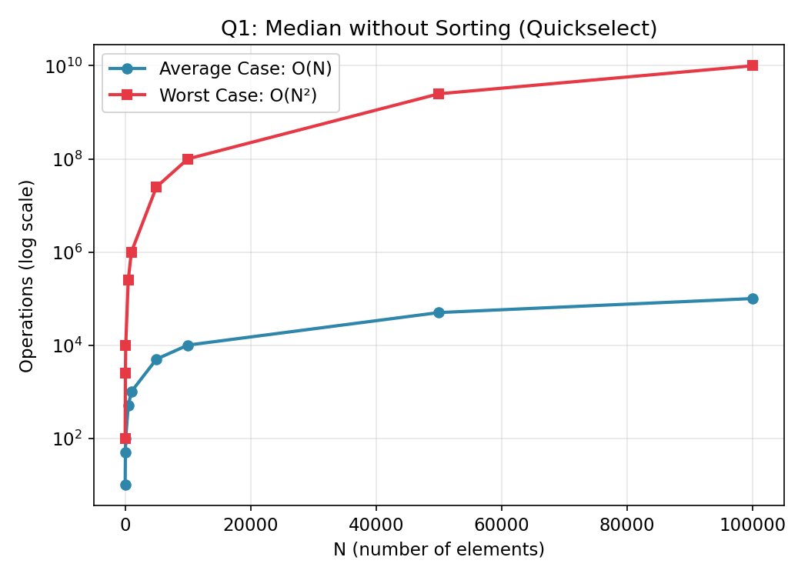

# Q1 — Find the Median of N Numbers Without Sorting

## Files in this folder
1. `median.c` — the C program
2. `complexity_data.csv` — operation counts used to plot the graph below
3. `complexity_graph.png` — visual growth of average vs worst case
4. `README.md` — this file

## Approach
We use **Quickselect** (a variant of QuickSort's partitioning) instead
of sorting the whole list. Each partition step places one pivot at its
final sorted position and tells us whether the median lies to its left
or right — so we only ever recurse into **one side**, never both.

- Odd N → the middle element (rank N/2) is the median.
- Even N → average of the two middle elements (ranks N/2 - 1 and N/2).

## Time Complexity

| Case | Complexity | Why |
|------|------------|-----|
| Average | **O(N)** | Partition costs O(N); pivot roughly halves the array each round → T(N) = T(N/2) + O(N) |
| Worst | **O(N²)** | Unlucky pivot every time (always smallest/largest) → T(N) = T(N-1) + O(N) |

**Space Complexity:** O(1) extra (in-place partition), O(log N) average
recursion stack (O(N) worst case).

The randomized pivot in the code makes the O(N²) worst case extremely
unlikely in practice.

## Graph

Data used to plot this graph is in [`complexity_data.csv`](complexity_data.csv).
