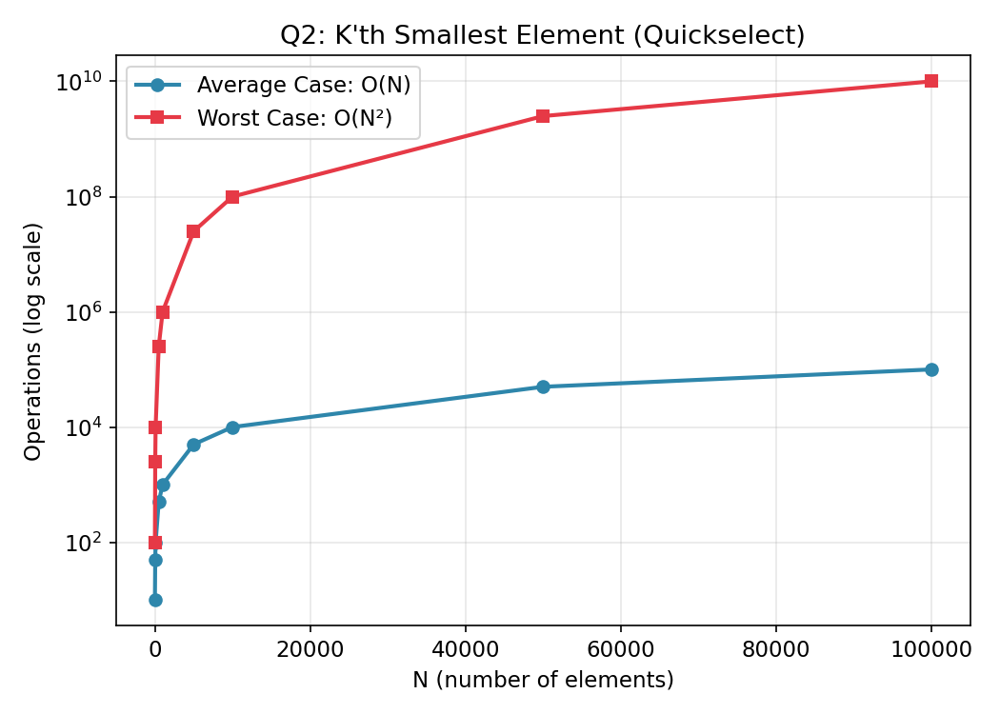

# Q2 — Find the K'th Smallest Element Without Sorting

## Files in this folder
1. `kth_smallest.c` — the C program
2. `complexity_data.csv` — operation counts used to plot the graph below
3. `complexity_graph.png` — visual growth of average vs worst case
4. `README.md` — this file

## Approach
Same **Quickselect** technique as Q1, generalized to any rank K
(1 = smallest, N = largest) instead of always looking for the middle
element. We convert the 1-based K entered by the user to a 0-based
array index (K - 1) and run quickselect for that index.

## Time Complexity

| Case | Complexity | Why |
|------|------------|-----|
| Average | **O(N)** | Pivot roughly halves the search range each round → T(N) = T(N/2) + O(N) |
| Worst | **O(N²)** | Unlucky pivot every time → T(N) = T(N-1) + O(N) |

**Space Complexity:** O(1) extra, O(log N) average recursion stack
(O(N) worst case).

This is far better than sorting first (O(N log N)) when we only need
one particular rank, especially for large N.

## Graph

Data used to plot this graph is in [`complexity_data.csv`](complexity_data.csv).
