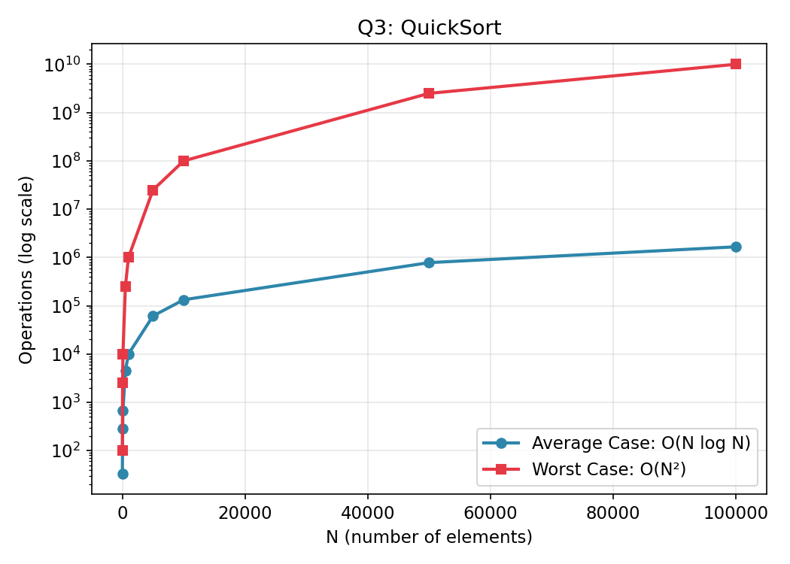

# Q3 — QuickSort on N Random Elements Stored in a File

## Files in this folder
1. `quicksort.c` — the C program
2. `complexity_data.csv` — operation counts used to plot the graph below
3. `complexity_graph.png` — visual growth of average vs worst case
4. `README.md` — this file

## Approach
1. Generate N random numbers and write them to `input.txt`.
2. Read the numbers back into an array.
3. Sort using classic **QuickSort** (Lomuto partition: pick a pivot,
   place smaller elements to its left and bigger ones to its right,
   then recursively sort both sides).
4. Write the sorted array to `output.txt`.

## Time Complexity

| Case | Complexity | Why |
|------|------------|-----|
| Average | **O(N log N)** | Pivot roughly splits the array in half → T(N) = 2T(N/2) + O(N) |
| Worst | **O(N²)** | Unlucky pivot every time (e.g. already-sorted input) → T(N) = T(N-1) + O(N) |

**Space Complexity:** O(log N) average recursion stack (O(N) worst
case); sorting itself is done in-place.

## Graph

Data used to plot this graph is in [`complexity_data.csv`](complexity_data.csv).
