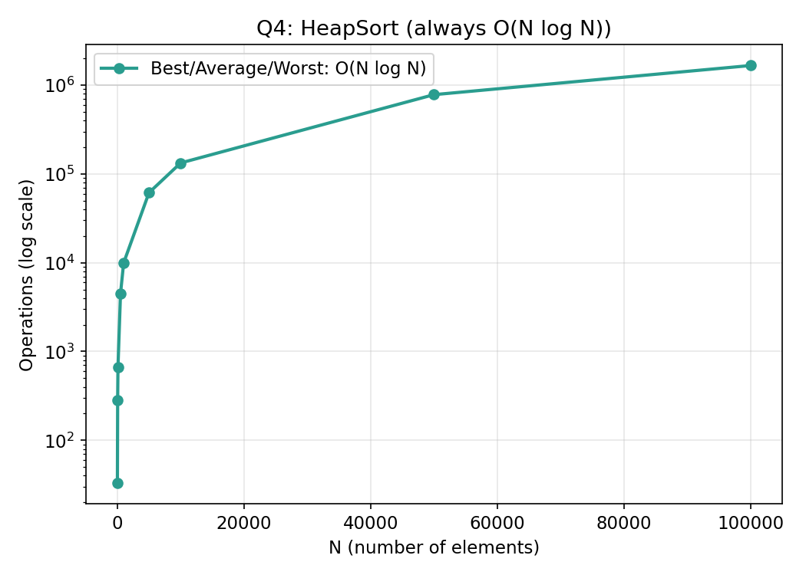

# Q4 — Heap Sort on N Randomly Generated Elements Stored in a File

## Files in this folder
1. `heapsort.c` — the C program
2. `complexity_data.csv` — operation counts used to plot the graph below
3. `complexity_graph.png` — visual growth of time complexity
4. `README.md` — this file

## Approach
1. Generate N random numbers and write them to `input.txt`.
2. Read the numbers back into an array.
3. Sort using **Heap Sort**:
   - Build a max-heap from the array (largest element at the root).
   - Repeatedly swap the root with the last unsorted element, shrink
     the heap, and re-heapify. This places elements at the end of the
     array in increasing order.
4. Write the sorted array to `output.txt`.

## Time Complexity

| Case | Complexity | Why |
|------|------------|-----|
| Best | **O(N log N)** | Building heap costs O(N); N extractions each cost O(log N) |
| Average | **O(N log N)** | Same as above |
| Worst | **O(N log N)** | No bad-pivot scenario exists — always O(N log N) |

**Space Complexity:** O(1) extra — fully in-place.

Unlike QuickSort, HeapSort has **no worst-case blow-up**; it always
runs at O(N log N), which is its biggest advantage.

## Graph

Data used to plot this graph is in [`complexity_data.csv`](complexity_data.csv).
